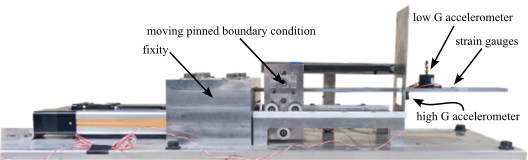

# Dataset 8 DROPBEAR Acceleration vs Roller Displacement

This data set consists of acceleration data measured from the Reproduction of Projectiles in Ballistic Environments for Advanced Research (DROPBEAR) experimental testbed with movable roller support as shown in Figure 1. This dataset was developed as an extension to Dataset-2 <a href="https://github.com/High-Rate-SHM-Working-Group/Dataset-2-DROPBEAR-Acceleration-vs-Roller-Displacement">here</a> with an emphasis on the generation of data in the quality and quantity needed to apply machine learning approaches. A video of the older test configuration can be found <a href="https://www.youtube.com/watch?v=ZB6AUWgWyJU&ab_channel=ARTS-LabattheUniversityofSouthCarolinaARTS-LabattheUniversityofSouthCarolina">here</a>.

For the test in this dataset, DROPBEAR consists of a 51 x 6.66 x 501 mm beam with two accelerometers mounted on the cantilever beam and two strain gauges. 

  

Figure 1: The Dynamic Reproduction of Projectiles in Ballistic Environments for Advanced Research (DROPBEAR) experimental testbed with key components annotated. This image is released under a CC-BY-SA-4.0 license and citable as [DROPBEAR Testbed Dataset #8, Austin Downey, CC BY-SA 4.0 <https://creativecommons.org/licenses/by-sa/4.0>, via Github].

## Licensing and Citation

[![CC BY-SA 4.0][cc-by-sa-shield]][cc-by-sa]

Where applicable and legal, this work is licensed under a [Creative Commons Attribution-ShareAlike 4.0 International License][cc-by-sa]. This license is not intended to supersede government license requirements. In good faith, all images within the repository are assumed to be licensed under a cc-by-sa [Creative Commons Attribution-ShareAlike 4.0 International License][cc-by-sa].
 

[cc-by-sa]: http://creativecommons.org/licenses/by-sa/4.0/
[cc-by-sa-image]: https://licensebuttons.net/l/by-sa/4.0/88x31.png
[cc-by-sa-shield]: https://img.shields.io/badge/License-CC%20BY--SA%204.0-lightgrey.svg

Cite this data as: 

Alexander Vereen, Austin Downey, Jacob Dodson, Adriane G Moura “Dataset-8-dropbearacceleration-vs-roller-displacement,” Aug. 2023. [Online]. Available: https://github.com/High-Rate-SHM-Working-Group/Dataset-8-DROPBEAR-Acceleration-vs-Roller-Displacement

@Misc{Vereen2023Dataset8Dropbear,  
  author = {Alexander Vereen and Austin Downey and Jacob Dodson and Adriane G Moura},  
  month  = aug,  
  title  = {Dataset-8-DROPBEAR-Acceleration-vs-Roller-Displacement},  
  year   = {2023},  
  groups = {High-Rate-SHM-Working-Group},  
  url    = {https://github.com/High-Rate-SHM-Working-Group/Dataset-8-DROPBEAR-Acceleration-vs-Roller-Displacement},  
}  

